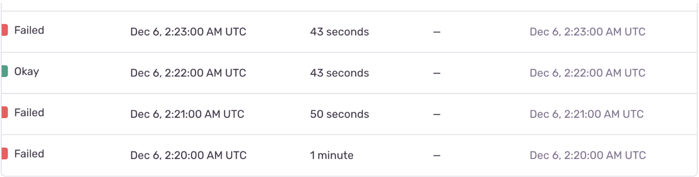
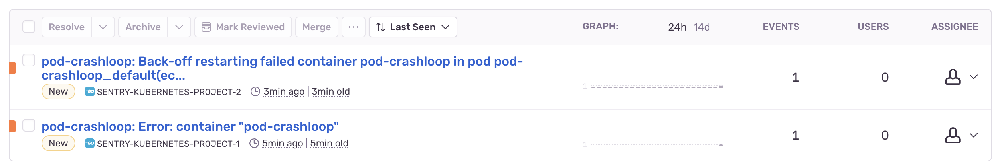

# sentry-kubernetes

Kubernetes event reporter for Sentry.

> This fork also attempts to add ARM support.

---

**⚠️ Note: this is BETA software that is still in development and may contain bugs. Use it at your own risk in production environments.**

**⚠️ Note: this is a new Go-based implementation of the agent. If you're looking for the documentation on the legacy Python-based implementation, [it was moved here](./py-legacy/).**

---

Errors and warnings in Kubernetes often go unnoticed by operators. Even when they are checked they are hard to read and understand in the context of what else is going on in the cluster. `sentry-kubernetes` is a small container you launch inside your Kubernetes cluster that will send errors and warnings to Sentry where they will be cleanly presented and intelligently grouped. Typical Sentry features such as notifications can then be used to help operation and developer visibility.

## Configuration

- `SENTRY_DSN` - Sentry DSN that will be used by the agent.

- `SENTRY_ENVIRONMENT` - Sentry environment that will be used for reported events.

- `SENTRY_K8S_WATCH_NAMESPACES` - a comma-separated list of namespaces that will be watched. Only the `default` namespace is watched by default. If you want to watch all namespaces, set the varible to value `__all__`.

- `SENTRY_K8S_WATCH_HISTORICAL` - if set to `1`, all existing (old) events will also be reported. Default is `0` (old events will not be reported).

- `SENTRY_K8S_CLUSTER_CONFIG_TYPE` - the type of the cluster initialization method. Allowed options: `auto`, `in-cluster`, `out-cluster`. Default is `auto`.

- `SENTRY_K8S_KUBECONFIG_PATH` - filesystem path to the `kubeconfig` configuration that will be used to connect to the cluster. Not used if `SENTRY_K8S_CLUSTER_CONFIG_TYPE` is set to `in-cluster`.

- `SENTRY_K8S_LOG_LEVEL` - logging level. Can be `trace`, `debug`, `info`, `warn`, `error`, `disabled`. Default is `info`.

- `SENTRY_K8S_MONITOR_CRONJOBS` - if set to `1`, enables Sentry Crons integration for `CronJob` objects. Disabled by default.

- `SENTRY_K8S_CUSTOM_DSNS` - if set to `1`, enables custom DSN to be specified in the `annotations` with key `k8s.sentry.io/dsn` which would take precedence over `SENTRY_DSN. Disabled by default.

### Adding custom tags

To add a custom tag to all events produced by the agent, set an environment variable, whose name is prefixed with `SENTRY_K8S_GLOBAL_TAG_`.

**Example:**

`SENTRY_K8S_GLOBAL_TAG_cluster_name=main-cluster` will add `cluster_name=main_cluster` tag to every outgoing Sentry event.

### Integrations

- `SENTRY_K8S_INTEGRATION_GKE_ENABLED` - if set to `1`, enable the [GKE](https://cloud.google.com/kubernetes-engine/) integration. Default is `0` (disabled).

  The GKE integration will attempt to fetch GKE/GCE metadata from [the GCP metadata server](https://cloud.google.com/compute/docs/metadata/overview), such as project name, cluster name, and cluster location.

### Client-side Filters

If you don't want to report certain kinds of events to Sentry, you can configure client-side filters.

- Event Reason: filtering by `Event.Reason` field.

  `SENTRY_K8S_FILTER_OUT_EVENT_REASONS` is a comma separated set of event Reason values. If the event's Reason is in that list, the event will be dropped. By default, the following reasons are filtered out (muted): `DockerStart`, `KubeletStart`, `NodeSysctlChange`, `ContainerdStart`.

- Event Source: filtering by `Event.Source.Component` field.

  `SENTRY_K8S_FILTER_OUT_EVENT_SOURCES` is a comma separated set of Source Component values (examples include `kubelet`, `default-cheduler`, `job-controller`, `kernel-monitor`). If the event's Source Component is in that list, the event will be dropped. By default, no events are filtered out by Source Component.

### Custom DSN Support

By default, the Sentry project that the agent sends events to is specified by the environment variable `SENTRY_DSN`. However, if the flag `SENTRY_K8S_CUSTOM_DSNS` is enabled, a Kubernetes object manifest may specify a custom `DSN` that takes precedence over the global `DSN`. To do so, specified the custom `DSN` in the `annotations` using the `k8s.sentry.io/dsn` key as follows:

```yaml
apiVersion: batch/v1
kind: CronJob
metadata:
  name: cronjob-basic-success
  labels:
    type: test-pod
  annotations:
    k8s.sentry.io/dsn: "<Insert DSN here>"
spec:
  schedule: "* * * * *"
  jobTemplate:
    spec:
      template:
        metadata:
          labels:
            type: test-pod
            run: cronjob-basic-success
        spec:
          containers:
            - name: hello
              image: busybox:1.28
              imagePullPolicy: IfNotPresent
              command:
                - /bin/sh
                - -c
                - date; echo Hello!; sleep 3
          restartPolicy: OnFailure
```

### Integration with Sentry Crons

A useful feature offered by Sentry is [Crons Monitoring](https://docs.sentry.io/product/crons/). This feature may be enabled by setting the environment variable `SENTRY_K8S_MONITOR_CRONJOBS` variable to true. The agent is compatible with Sentry Crons and can automatically [upsert](https://develop.sentry.dev/sdk/check-ins/#monitor-upsert-support) `CronJob` objects with a Sentry project.

The agent automatically creates a Crons monitor for any detected `CronJob` with the monitor slug name to be the name of the `CronJob`. Additionally, the schedule is automatically taken from the `CronJob` manifest.

Moreover, any the events of any resource object (e.g. `pod`, `job`, `event`) that is associated with a `CronJob` will have the corresponding monitor slug name is a metadata. This allows the grouping of events based on Crons monitors in Issues as well.

**Crons Example**

The following manifest is of a cronjob that sometimes fails and completes with variable durations:

```yaml
apiVersion: batch/v1
kind: CronJob
metadata:
  name: cronjob-late-maybe-error
  labels:
    type: test-pod
spec:
  schedule: "* * * * *"
  jobTemplate:
    spec:
      backoffLimit: 0
      template:
        metadata:
          labels:
            type: test-pod
            run: cronjob-late-maybe-error
        spec:
          containers:
            - name: hello
              image: busybox:1.28
              imagePullPolicy: IfNotPresent
              command:
                - /bin/sh
                - -c
                - |
                  MINWAIT=0
                  MAXWAIT=60
                  sleep $((MINWAIT+RANDOM % (MAXWAIT-MINWAIT)))
                  sleep 3
                  r=$((RANDOM%2))
                  if [ $r -eq 0 ]; then echo Hello!; else exit 1; fi
          restartPolicy: Never
```

In the Sentry Crons tab of the corresponding project, we may see the following:



## Local Development (out of cluster configuration)

1. Install necessary dependencies to run Kubernetes locally

   1. Install `docker` and start the docker daemon

      [https://docs.docker.com/engine/install/](https://docs.docker.com/engine/install/)

      `docker` is a service that manages containers and is used by Kubernetes to create nodes (since `kind` actually create Kubernetes “nodes” as docker containers rather than VMs)

   2. Install `kind` and add it to PATH

      [https://kind.sigs.k8s.io/docs/user/quick-start/](https://kind.sigs.k8s.io/docs/user/quick-start/)

      `kind` is a tool for running local Kubernetes clusters and we use it here for testing. The container runtime used by it is `containerd`, which is the same runtime used now by Docker.

   3. Install `kubectl`, which is the command line tool we use to interact with Kubernetes clusters ran locally by `kind`

      [https://kubernetes.io/docs/tasks/tools/](https://kubernetes.io/docs/tasks/tools/)

2. Run Kubernetes cluster locally for development purposes

   1. Create a Kubernetes cluster with `kind` using the command (the cluster name is “kind” by default)

   `kind create cluster`

   b. Output information about the created cluster named “kind” or some cluster name you have chosen using the following command (replacing `<cluster name>` with `kind` if default used)

   `kubectl cluster-info --context kind-<cluster name>`

   You should see an output similar to the following:

   ```bash
   Kubernetes control plane is running at https://127.0.0.1:61502
   CoreDNS is running at https://127.0.0.1:61502/api/v1/namespaces/kube-system/services/kube-dns:dns/proxy
   ```

3. Run the `sentry-kubernetes` Go module (which must be performed after the Kubernetes cluster is already running because the module requires the `kubeconfig` file)

   1. Clone the `sentry-kubernetes` repository

   `git clone https://github.com/getsentry/sentry-kubernetes.git`

   b. Pass a valid Sentry DSN to the an environment variable named `SENTRY_DSN` ([https://docs.sentry.io/product/sentry-basics/concepts/dsn-explainer/](https://docs.sentry.io/product/sentry-basics/concepts/dsn-explainer/))

   c. At the root of the repository directory, build the Go module with the command

   `make build`

   d. Run the module outside of the k8s cluster by executing the command

   `go run .`

   which now starts up the process that automatically detects the cluster configuration in order to detect events

4. Add error-producing pods to test event capturing

   1. Create resources (e.g. pods or deployments) using existing manifests meant to produce errors to be captured by `sentry-kubernetes`. For example, we can apply the manifest for a pod that exhibits crash loop behavior with the command

   `kubectl apply -f ./k8s/errors/pod-crashloop.yaml`

   b. Check that the pod is created using the command

   `kubectl get pods`

   which should produce an output similar to the following:

   ```bash
   NAME            READY   STATUS             RESTARTS       AGE
   pod-crashloop   0/1     CrashLoopBackOff   32 (33s ago)   3h10m
   ```

   Notice that the Status is `CrashLoopBackOff`, which is the intended state for our purpose

   c. Check that the `sentry-kubernetes` process capture this crash loop error by checking for the an output similar to the following:

   ```bash
   [Sentry] 2023/11/08 12:07:53 Using release from Git: abc123
   12:07PM INF Auto-detecting cluster configuration...
   12:07PM WRN Could not initialize in-cluster config
   12:07PM INF Detected out-of-cluster configuration
   12:07PM INF Running integrations...
   12:07PM INF Watching events starting from: Wed, 08 Nov 2023 12:07:53 -0800 namespace=default watcher=events
   12:07PM INF CronJob monitoring is disabled namespace=default watcher=events
   [Sentry] 2023/11/08 12:09:27 Sending error event [w0dc9c22094d7rg9b27afabc868e32] to o4506191942320128.ingest.sentry.io project: 4506191948087296
   [Sentry] 2023/11/08 12:10:57 Sending error event [4808b623f0eb446eac0eb6c5f0a43681] to o4506191942320128.ingest.sentry.io project: 4506191948087296
   ```

   d. Check the `Issues` tab of the corresponding Sentry project to ensure the events captured are shown similar to below:

   

## Caveats

- When the same event (for example, a failed readiness check) happens multiple times, Kubernetes might not report each of them individually, and instead combine them, and send with some backoff. The event message in that case will be prefixed with "(combined from similar events)" string, that we currently strip. AFAIK, there's no way to disable this batching behaviour.

## Potential Improvements

- For pod-related events: fetch last log lines and displaying them as breadcrumbs or stacktrace.
